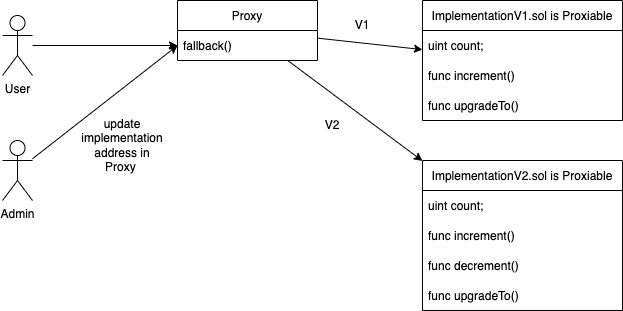

# Simple UUPS (EIP-1822) Upgrade pattern example without using Openzeppelin

##### In this repo you can find a simple example of implementing the upgrading pattern EIP-1822 Universal Upgradeable Proxy Standard, with code pulled straight from the EIP docs : https://eips.ethereum.org/EIPS/eip-1822

##### This example is only for learning purposes and must not be used in production. Please use Openzeppelins upgradeable library to securely implement the UUPS pattern.
#

> Similarly to the TransparentUpgradeableProxy Pattern, UUPS relies on implementing a Proxy contract and using delegatecall+fallback to forward function calls to the Implementation contract and execute in the context of the Proxy. One of the main differences between TransparentProxy and UUPS is their implementation of the Proxy Admin. In TransparentProxy the proxy admin is located in a seperate ProxyAdmin contract while in UUPS the Proxy Admin is implemented in the Implementation contract. Therefore every UUPS Implementation contract must inherit Proxiable.sol and use it to extend capability to update the Implementation contract address set inside the Proxy. Failure to do so can break the Proxy. 
#
> While this is a downside of the UUPS Pattern the benefit is that UUPS reduces the cost of proxy function calls because the Proxy contract no longer has to check upon every call whether msg.sender is equal to the admin address kept in storage and as we know storage read/writes are some of the most expensive operations in a transaction.

